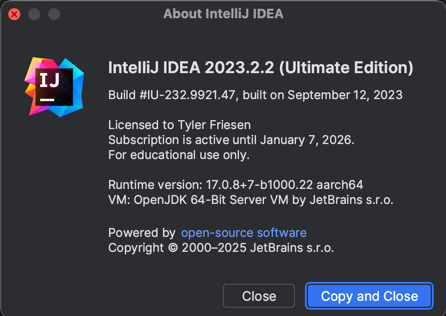
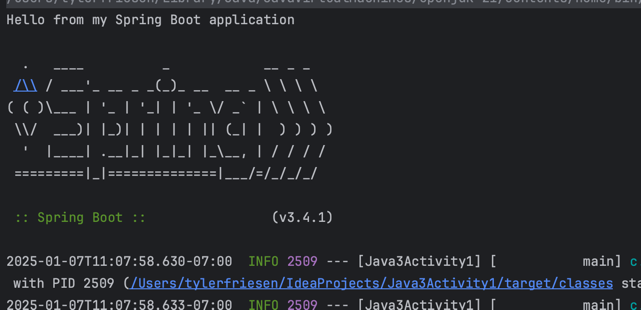
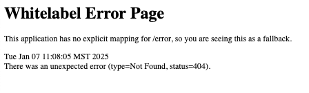
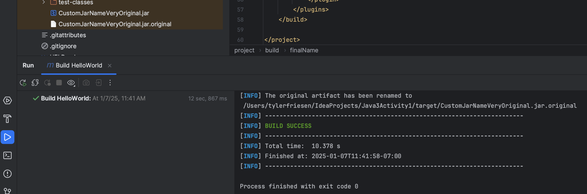
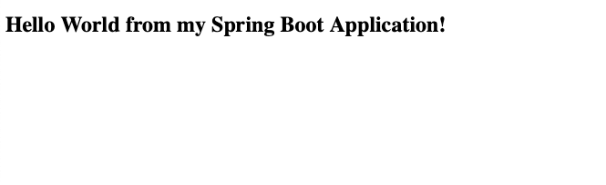

# CST339 - Activity 1
- Date: 2025 January 8
- Author: Tyler Friesen
--- 

### Intellij About (not using Spring Tool Suite)

### Hello World in the console from Spring Boot

---

### White label error from Spring Boot at localhost:8080

---

### localhost:8080 after adding the index.html

---

### Maven built CustomJarNameVeryOriginal.jar and build success

---

### Spring Boot App being launched from Jar file.

---
## Research Questions

1. The Spring Framework and Spring Boot are both used to build web applications with Java. However,
there are some key differences between them. The Spring framework is older than Spring Boot, it was
released in 2003 whereas Spring Boot was introduced in 2014. Spring Boot is also not a completely separate
framework (like Django is to Flask in Python) but rather builds on top of the Spring Framework. The goal
with Spring Boot was to create a layer of abstraction that can handle more of the nitty gritty details
that you would normally manually handle in the Spring Framework. Things like configuring web servers like Tomcat
are standard out of the box. Spring Boot also comes with production ready features on first install whereas
Spring requires manual configuration to be set up for production.

2. Both Gradle and Maven are build automation tools. They can create Jars to package applications, compile code,
run tests, and manage dependencies. So far we have only used Maven to manage dependencies (or at least I did
since spring-boot-starter-web wasn't installed by default) and to manage package building (by renaming the output)
Maven uses XML in its configuration (pom.xml). This is the same type of format that is used for HTML pages.
Gradle on the other hand uses build.gradle files to manage its configuration (which does not use XML format).
Maven has simpler structure to understand for beginners whereas Gradle can be more complex because of how flexible
it is. However this doesn't necessarily make Maven better. Maven has a linear build speed time due to its rigid
build cycle, Gradle does incremental builds only building what has changed from the last build.

---
## Participation Discussion and Responses
__Topic 1 - Participation Question 1__
- Class, we learned about the Spring Tool Suite (STS), please explain the following with technical details:
  - What is the Spring Framework?
> The Spring Framework is a Java-based framework used primarily for building web applications.
> It was originally introduced in 2003, however it was followed by Spring Boot in 2014 which 
> is more friendly to use for developers. It promotes easy testing, maintenance, and scalability
> which is why it is used in enterprise applications so frequently (I had an offer to intern at StateFarm
> and that is what they said they used there).
  - What is Spring tool Suite (STS)?
> Spring Tool Suite is an Eclipse based IDE designed to simplify the development of Spring based
> applications. It provides a collection of tools that specifically support the Spring Framework 
> and its various projects. It makes it easy to create Spring projects, configure XML or Java Spring configs,
> and even running and debugging Spring applications. STS also comes with features like live debugging, 
> easy navigation between application layers, and a robust testing environment, making it a go-to tool for 
> developers working in the Spring ecosystem.

__Topic 1 - Participation Question 2__
- Class, we learned about Maven, please explain the following with technical details:
  - What is Maven?
> Maven is a build automation and project management tool used primarily for Java
> applications. It simplifies the process of building, packaging, and deploying projects by managing
> dependencies, compiling source code, running tests, and generating documentation. Maven uses
> an XML-based configuration file, the pom.xml, to define how the project is built and
> what dependencies it requires. It also supports a consistent project structure and lifecycle, which
> includes compiling code, testing, packaging, and deployment phases (which is something we used
> when making our Maven run configuration for this activity). Maven centralizes
> dependency management by allowing projects to pull in external libraries and tools automatically
> from a central repository, which reduces the need for manual configuration.
  - What is the Project Object Model (POM) File?
> The Project Object Model (POM) file is the core configuration file used in Maven-based projects. It
> is written in XML format and contains information about the project being built, such as
> its name, version, dependencies, build configuration, plugins, and any external resources the
> project needs. The POM defines the project’s structure and handles its lifecycle through phases
> like compile, test, and package. It also allows developers to define and manage dependencies in a
> structured and hierarchical manner, making it easy to include, exclude, or update libraries required
> by the project. 
---
## Conclusion
> The Spring Framework, along with tools like STS and Maven, simplifies the development of Java-
> based enterprise applications. While the Spring Framework offers a flexible foundation for building 
> scalable and maintainable applications, tools like Spring Boot abstract away complex 
> configurations to make the setup and development process faster. STS enhances the experience 
> of working with Spring by providing an IDE specifically tailored for it, while Maven serves as a 
> project management tool that simplifies building, testing, and managing dependencies for projects.
