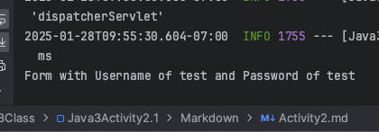

# CST339 - Activity 2
- Date: 2025 February 2
- Author: Tyler Friesen

# Part 1 

--- 

### First controller route "/test1"

---

### Second controller route "/test2"

---

### Third controller route "/test3"

---

### Fourth route, redirecting from /test2 to /test4

---

### Adding more anchor tags to the /test2 route (also verifying /test2 and /test3 work)

---

### Created new Home Controller and associated View

---

# Part 2

### Login Form (localhost:8080/login/)

---

### Login Form Post, response from console

---

### Order table after logging in

---

### Login validation

---

# Part 3

### Added common/default template to the login page

---

### Added commmon/default template to the order page

---

# Research Questions

1. Spring MVC is a Java-based framework that supports the
Model-View-Controller (MVC) design pattern by separating
the application into three core components: the Model, 
View, and Controller. The Model represents the 
application's data and business logic, typically implemented through 
JavaBeans or POJOs (Plain Old Java Objects). These objects contain the core business data and can be manipulated 
or fetched by the Controller. The View is responsible for rendering the model data to the user, typically using 
technologies like JSP, Thymeleaf, or FreeMarker. This layer handles how the user interface is structured and presented. 
Finally, the Controller acts as the intermediary between the Model and the View. It processes user requests, interacts 
with the Model to manipulate or retrieve data, and returns a View to display the data to the user. The Controller is 
mapped to URLs through annotations, which determines which method should handle the incoming HTTP request. 
This clear separation ensures that the application is organized, making it easier to maintain and scale.
 

---

2. Two other popular MVC frameworks, apart from Spring MVC, are ASP.NET MVC and Ruby on Rails (RoR). ASP.NET MVC is a 
framework developed by Microsoft for building web applications using the .NET platform, primarily with C#. It follows 
the MVC pattern but is tied to the Microsoft ecosystem, offering features like built-in routing and integration with 
other .NET technologies such as Entity Framework for data access. It’s tightly integrated with the Visual Studio IDE, 
making development streamlined within the Microsoft ecosystem. In contrast, Spring MVC is Java-based and offers 
broader flexibility for integrating with various Java technologies, such as Spring Boot for rapid application 
development or Spring Security for securing web applications. Another key difference is that ASP.NET MVC is 
typically more opinionated regarding project structure, whereas Spring MVC provides more flexibility in terms of configuration.

- Ruby on Rails, on the other hand, is a web framework built using the Ruby programming language. Rails also follows the 
MVC design pattern but emphasizes “convention over configuration.” This means that Rails relies heavily on sensible 
defaults, reducing the need for explicit configuration from the developer. Rails is known for its speed of development, 
with built-in tools for scaffolding, migrations, and handling database queries through ActiveRecord. Unlike Spring MVC,
which requires more configuration but offers greater flexibility, Rails provides rapid development for database-backed 
applications, making it popular among startups and small to medium-sized applications. Rails' focus on
convention allows developers to build applications quickly without needing to make decisions about structure, 
whereas Spring MVC gives developers more control and flexibility at the cost of more configuration.