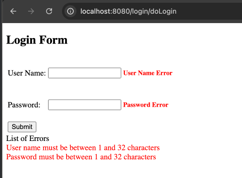

# CST339 - Activity 2
- Date: 2025 February 2
- Author: Tyler Friesen

# Part 1 

--- 

### First controller route "/test1"

---

### Second controller route "/test2"

---

### Third controller route "/test3"

---

### Fourth route, redirecting from /test2 to /test4

---

### Adding more anchor tags to the /test2 route (also verifying /test2 and /test3 work)

---

### Created new Home Controller and associated View

---

# Part 2

### Login Form (localhost:8080/login/)

---

### Login Form Post, response from console

---

### Order table after logging in

---

### Login validation

---

# Part 3

### Added common/default template to the login page

---

### Added commmon/default template to the order page

