# CST339 - Activity 2
- Date: 2025 February 2
- Author: Tyler Friesen

# Part 1 

--- 

### Console window printing after logging in using the OrdersBusinessService
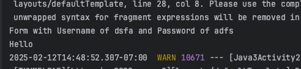

---

### Console window printing after logging in using the AnotherOrdersBusinessService
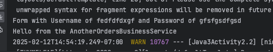

---

### Console window printing after logging in using the SecurityBusinessService
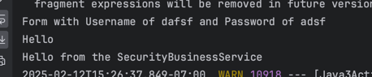

---

### Orders being displayed after using the OrdersBusinessService as opposed to creating the OrderModelList directly in the Login Controller
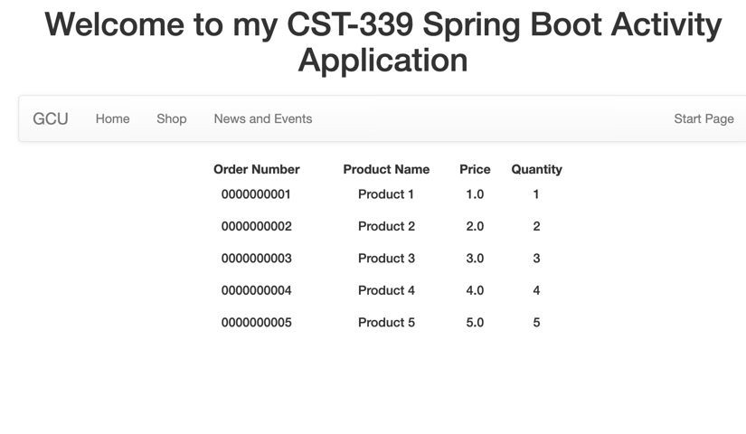

---

# Part 2
# Prototype Scope
### Init OrdersBusinessService being called in the console
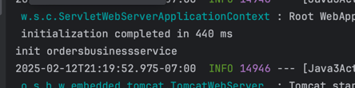

### Destroy OrdersBusinessService being called in the console
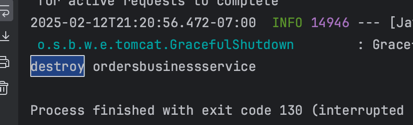

Explanation: 
- In the Topic3-2 project, the init() method of the OrdersBusinessService class is called when the Spring context 
 initializes the bean, typically when the application starts. This method is used to perform any initialization tasks, 
 and the destroy() method is called when the Spring container shuts down or the bean is destroyed, which typically 
 happens when the application is stopped. The number of calls to init() depends on the number of beans of type 
 OrdersBusinessService created by the Spring container. Since there is only one instance of this bean, init() is called 
 once when the application starts.
 
---
# Request Scope
### First login attempt showing init() method call
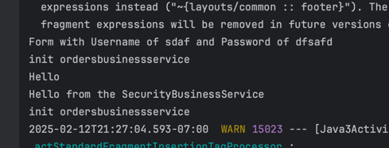

### Second login attempt showing init() method call

### Third login attempt showing init() method call

Explanation:
- The OrdersBusinessService bean is configured with the prototype scope, meaning a new instance of the service is 
 created every time it is requested. When a form is submitted on the login page, the `OrdersBusinessService` is 
 injected into the LoginController, triggering the creation of a new instance. As a result, the `init()` method is 
 called each time a new instance is created, and this happens every time the form is submitted. This is why the `init()` 
 method gets called multiple times in the console log.

---
# Session Scope
### First login attempt from first browser showing init() method call
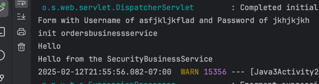

### Second login attempt from second browser showing init() method call

Explanation:
- The `OrdersBusinessService`'s `init()` method is called once per browser session due to the `@SessionScope` 
 annotation. This ensures that each browser session receives its own instance of the service. Therefore, when 
 submitting the form from two different browser windows, the `init()` method is invoked twice—once for each session.
---
# Singleton Scope
### Login attempt showing init() method call
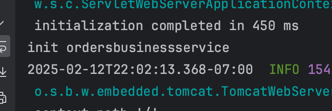

Explanation:
- In this case, the `init()` method of the `OrdersBusinessService` was called only once because we changed the bean's
 scope from `@SessionScope` to the default singleton scope. In singleton scope, the bean is created only once when the 
 application starts, and the `init()` method is called at that time. Submitting the form multiple times does not trigger 
 additional calls to `init()`, since the same instance of the `OrdersBusinessService` is reused across all requests.

---

# Part 3

### /getjson route on new RestController that we created
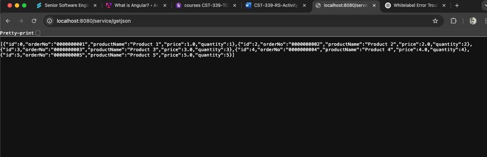

---

### /getxml route on the new RestController that we created
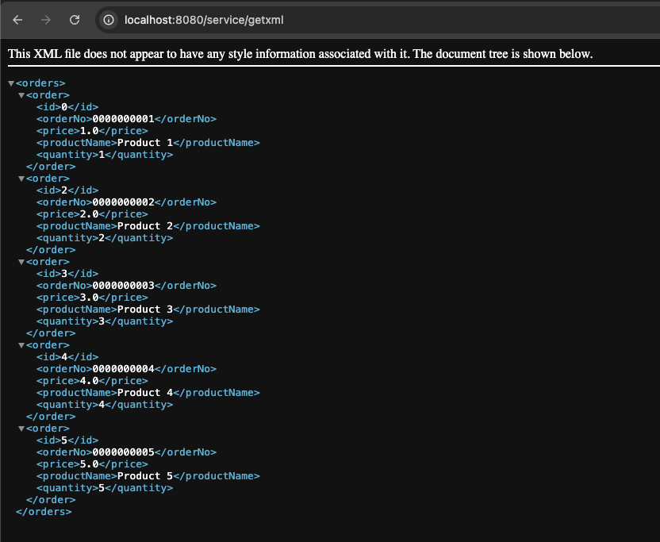

---

### Swagger documentation (look for the swaggerdocs.yaml and then paste it in the online editor here https://editor.swagger.io/#/)
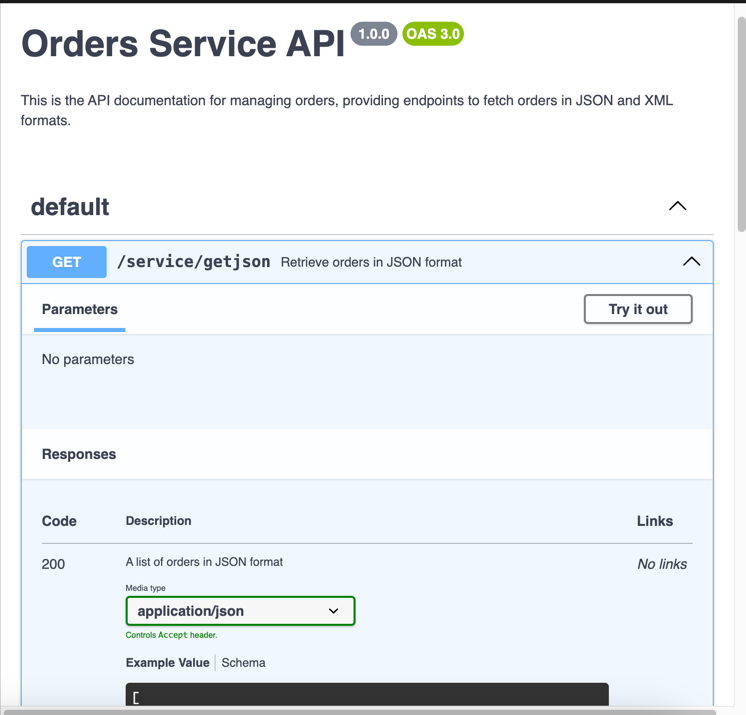
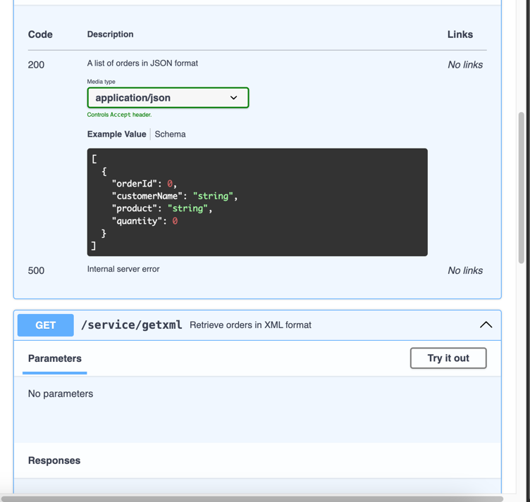
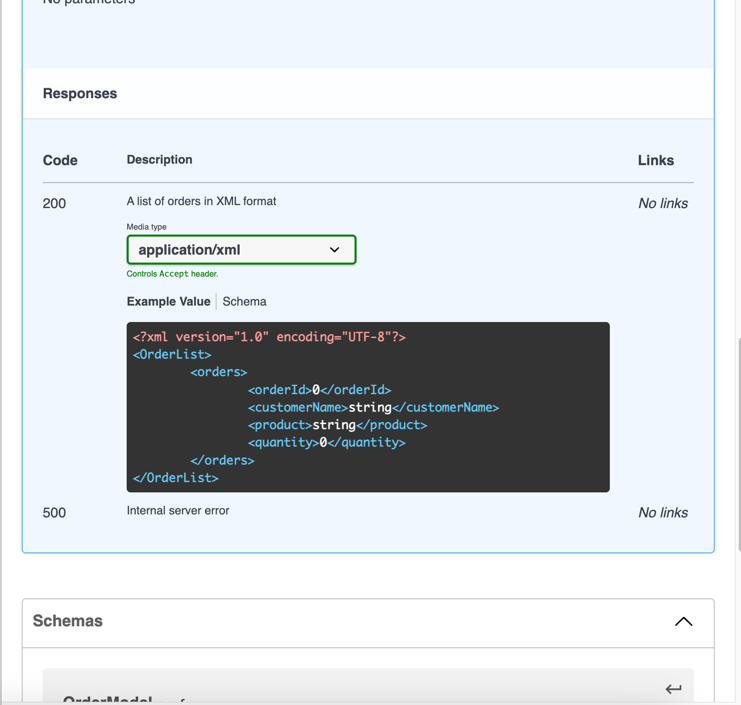
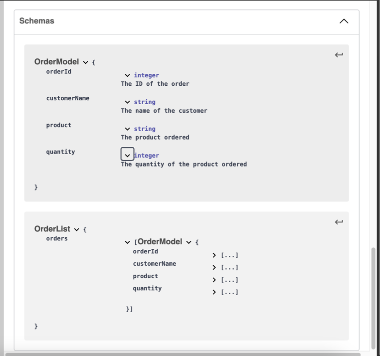

---

### Postman testing (/getjson then /getxml)
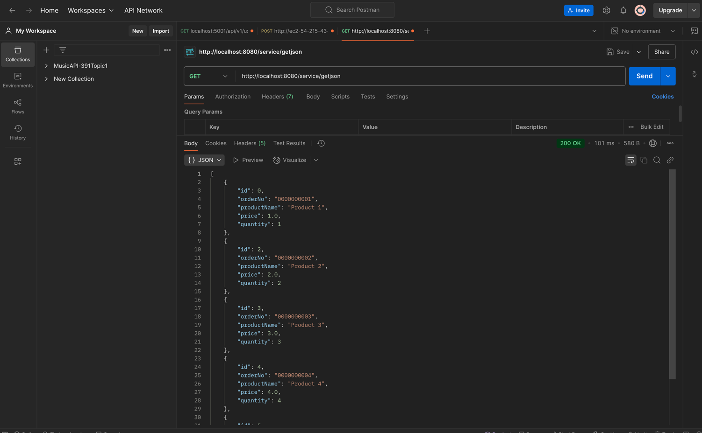

---

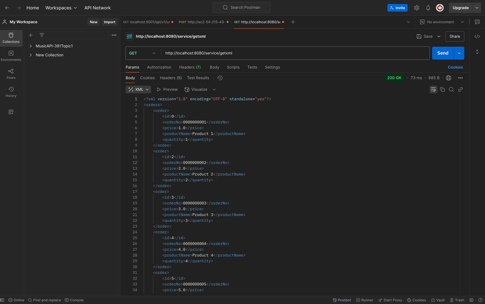

---

# Research Questions:
- In Spring, `@Component`, `@Service`, and `@Bean` are used to define beans, but each serves a different purpose. 
 `@Component` is the most generic annotation, used to mark a class as a Spring-managed bean without specifying its role.
 `@Service` is a specialization of `@Component`, intended to represent service layer beans that contain business logic, 
 making it more semantically appropriate for service-related classes. On the other hand, `@Bean` is used within 
 `@Configuration` classes to manually define beans and provide more control over their instantiation, such as 
 configuring constructors or setting properties. Use `@Component` for general-purpose beans, `@Service` for business 
 logic or service-layer classes, and `@Bean` when you need explicit control over bean creation in a configuration class. 

- An Inversion of Control (IoC) Container forces you to design and code to interface contracts because it promotes loose 
 coupling and flexibility. By depending on interfaces rather than concrete implementations, components in your 
 application are decoupled, meaning changes to one component won’t affect others as long as they adhere to the same 
 interface. This separation allows for easier maintenance and modification of code. Additionally, coding to interfaces 
 enhances flexibility, as the IoC container can inject different implementations at runtime based on configuration. It 
 also improves testability, as interfaces can be easily mocked or stubbed in unit tests, ensuring that tests focus on 
 specific logic rather than complex dependencies. Ultimately, designing to interfaces ensures that your code is more 
 maintainable, adaptable, and easier to test.