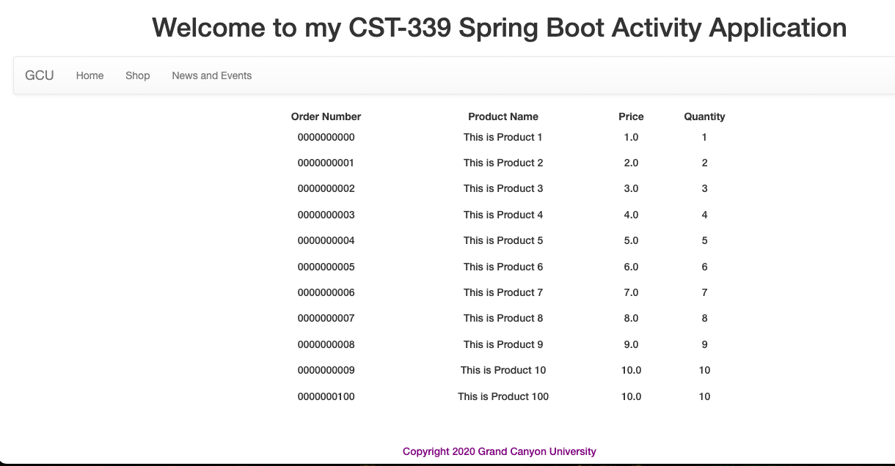
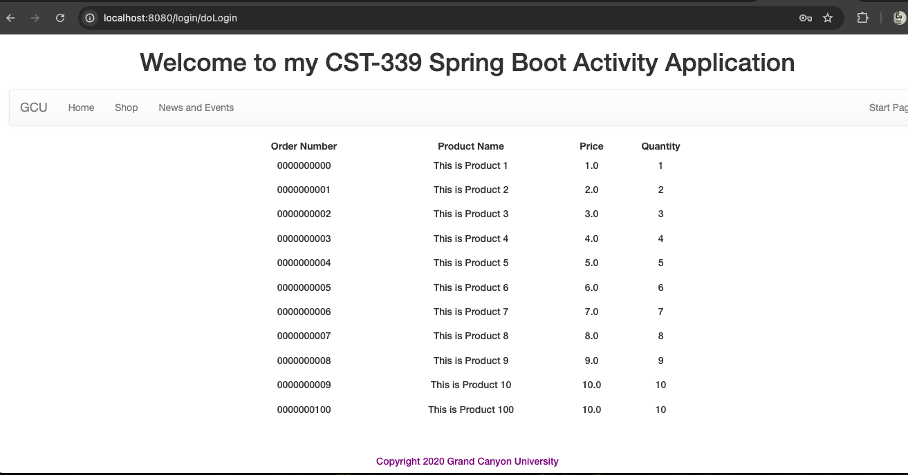
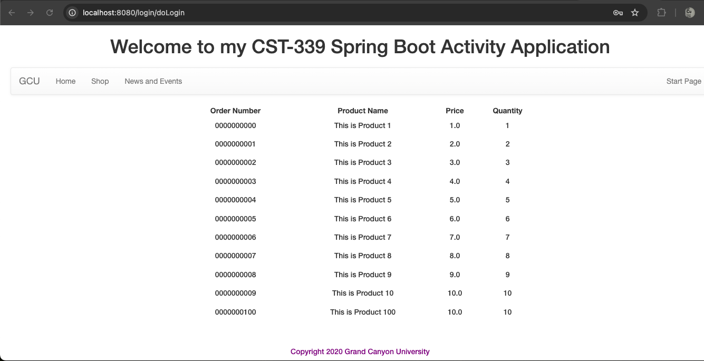

# CST339 - Activity 2
- Date: 2025 March 9
- Author: Tyler Friesen

# Part 1 

--- 

### After submitting the login form, these are the records from the database

---

# Part 2

---

### After submitting the login form in the new (more scalable) application

---

# Part 3

---

### Final order page, this is after changing out the Spring Data JDBC from the natural JDBC

---

## Research Questions

1. Spring Data JDBC simplifies the interaction with relational databases by providing an abstraction layer over traditional Java JDBC. Unlike standard JDBC, where you manually manage database connections, statements, and result sets, Spring Data JDBC allows developers to focus on higher-level operations like repositories and basic CRUD operations. It reduces boilerplate code by handling common tasks such as mapping data between Java objects and database tables, though it doesn’t offer the extensive ORM capabilities of JPA. Instead, it provides a lightweight, efficient alternative to full-blown ORM frameworks like Hibernate, focusing on simplicity while maintaining control over SQL and performance.
2. Spring Data JDBC supports transaction management and adheres to the ACID principles through Spring’s transaction management system. By using annotations like @Transactional, it ensures atomicity by rolling back changes if a transaction fails. It provides consistency by ensuring that database state transitions are valid, even in failure scenarios. Additionally, Spring allows developers to configure transaction isolation levels to control how transactions are isolated from each other, preventing issues like dirty reads. The combination of declarative transaction management and database features ensures that the ACID properties—Atomicity, Consistency, Isolation, and Durability—are maintained in applications built with Spring Data JDBC.