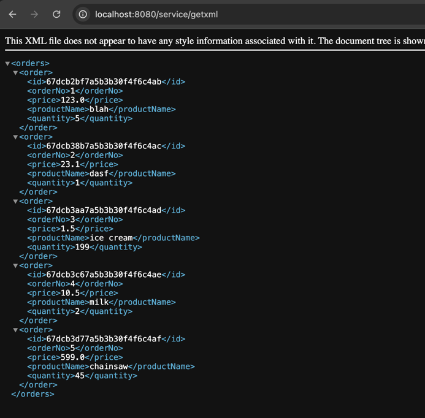

# CST339 - Activity 5
- Date: 2025 March 20
- Author: Tyler Friesen

# Part 1 

--- 

### The orders page after switching the application to use MongoDB

---

### The JSON endpoint using MongoDB

---

### The XML endpoint using MongoDB

---

# Part 2

---

### Getting a particular record (in JSON) by the ID

---

### Failing to get a particular record because it doesn't exist

---

## Research Questions

1. Relational databases have a structured, predefined schema where data is stored in tables with rows and columns, and relationships between tables are defined using primary and foreign keys. This schema is rigid, requiring changes to the entire structure when data evolves. Relational databases use normalization to minimize redundancy and maintain data integrity, while also ensuring ACID (Atomicity, Consistency, Isolation, Durability) properties for transaction reliability. Nonrelational databases, however, offer more flexibility with dynamic schemas, allowing data to be stored in various formats like key-value pairs, documents, or graphs. There’s no need for a fixed schema, and data is often denormalized, which can improve read performance. These databases prioritize scalability and availability, often following eventual consistency rather than ACID properties. Migrating from a relational to a nonrelational database requires changes in data structure design. While relational databases enforce consistency and integrity, nonrelational databases require more management at the application level. Additionally, complex queries (like joins) that relational databases handle easily may need custom logic in nonrelational databases.

2. Relational databases excel in structured data storage and support complex SQL queries with joins, making them ideal for applications needing strong data consistency and integrity. With ACID transaction support, relational databases are perfect for systems like banking where consistency is critical. Nonrelational databases, on the other hand, prioritize scalability and flexibility, handling large volumes of unstructured or semi-structured data. They are suitable for big data applications, real-time processing, or distributed systems where performance and availability are more important than strict consistency. Nonrelational databases follow BASE (Basically Available, Soft state, Eventual consistency) properties, allowing for better distribution and fault tolerance. Relational databases are ideal when you need data consistency, complex querying, and a structured schema, whereas nonrelational databases excel with flexible data models, scalability, and performance for large or distributed datasets. Each has its strengths depending on the specific needs of the application.