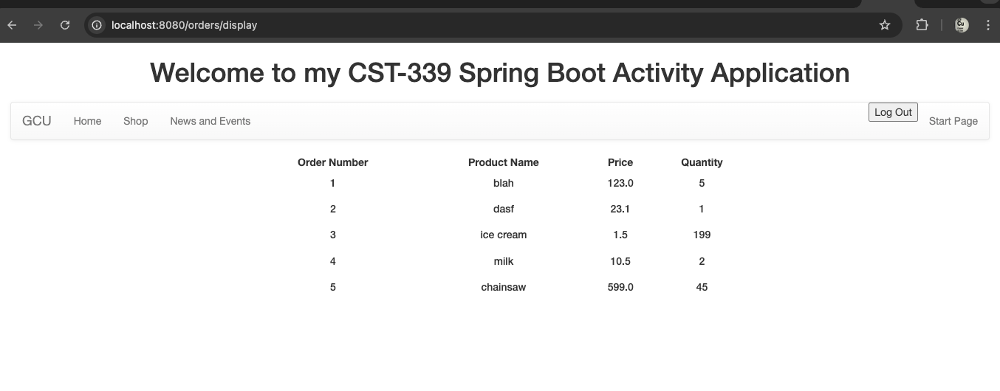
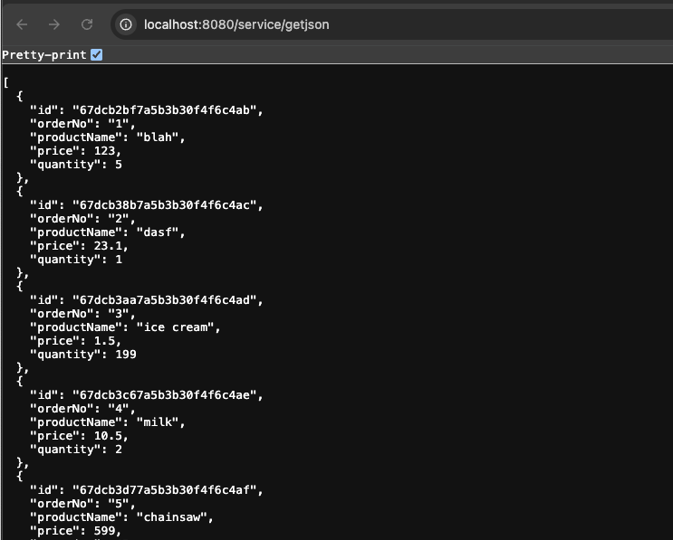
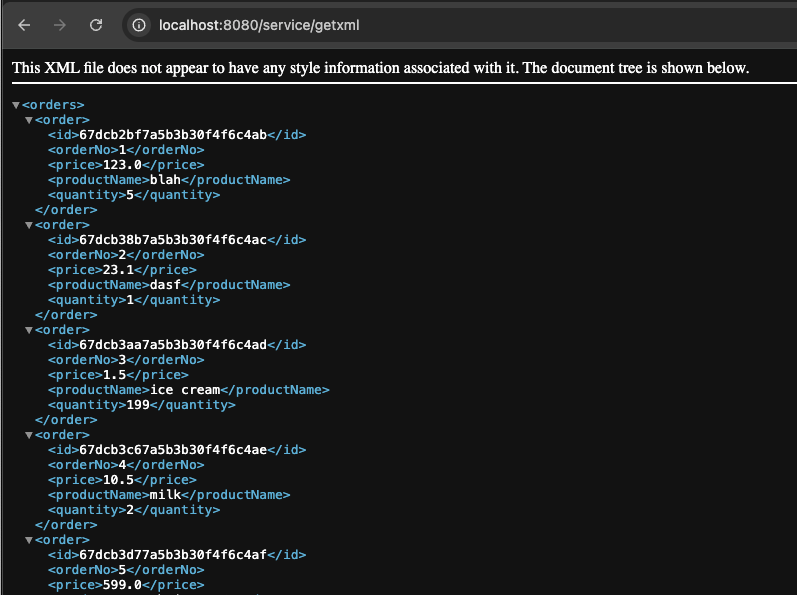
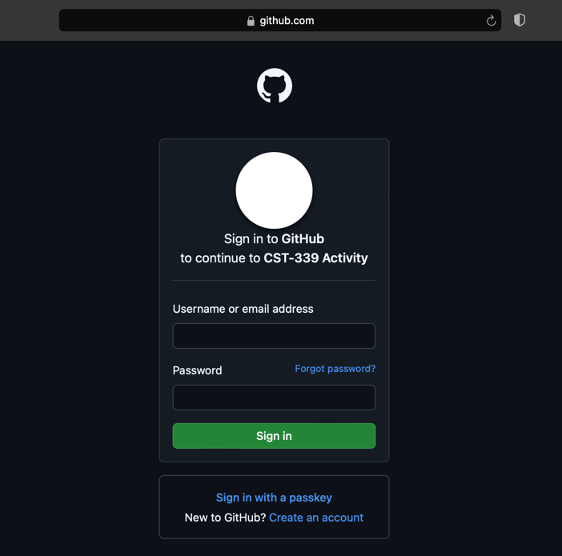
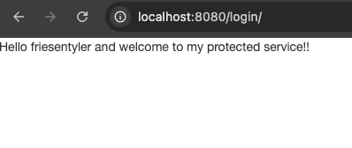

# CST339 - Activity 6
- Date: 2025 March 27
- Author: Tyler Friesen

# Part 1 

--- 

### The Orders page after logging in with the new Spring Security module being utilized

---

### The /getjson page after logging in with Spring Security

---

### The /getxml page after logging in with Spring Security

---

# Part 2

According to the GitLab instructions this part of the activity is broken, so I have not provided
screenshots, I wrote the code from the activity and confirmed for myself that it is broken

---

# Part 3
According to the GitLab instructions this part of the activity is broken, so I have not provided
screenshots, I wrote the code from the activity and confirmed for myself that it is broken

---

# Part 4

---

### Sign in to GitHub page, using OAuth with my CST-339 Application

---

### After doing OAuth through GitHub my application redirects to this protected page

---

## Research Questions

1. Forms Based Authentication is a method used in web applications where users submit their login credentials, typically a username and password, through an HTML form. This form sends the information to the server via a POST request, where the server verifies the credentials against a user database, such as an LDAP or SQL database. If the credentials are valid, the server generates a session token, usually stored in a cookie on the user's browser. This session token is then automatically included in subsequent requests, allowing the server to identify the user and maintain their authenticated session across different parts of the application.
One of the primary reasons Forms Based Authentication is widely used is its flexibility in handling various login and authentication scenarios. However, instead of developing custom security mechanisms, it is important to use established frameworks like Spring Security. Spring Security provides a robust, well-tested, and widely used solution for handling authentication and authorization, offering numerous security features out-of-the-box. Building a custom security framework from scratch is not only time-consuming but also risky, as it might overlook important security considerations such as handling session management, protection against common vulnerabilities like Cross-Site Scripting (XSS) and Cross-Site Request Forgery (CSRF), and secure password storage. By using Spring Security, developers can ensure their application adheres to best practices while focusing on other critical aspects of their project. 

2. Basic HTTP Authentication is a simple authentication mechanism used in client-server communication, particularly in RESTful APIs. In this scheme, the client sends an HTTP request to the server with an "Authorization" header that contains a base64-encoded string of the user's credentials, typically a username and password separated by a colon (e.g., "username:password"). Upon receiving the request, the server decodes the base64 string, checks the credentials against its user database, and, if valid, grants access to the requested resource.
This type of authentication is considered one of the simplest methods for securing a REST API, as it does not require cookies or session management on the server side. However, it is important to note that Basic HTTP Authentication should always be used over HTTPS, as the credentials are only base64-encoded and can easily be intercepted if sent over an unsecured connection. When used in combination with HTTPS, Basic HTTP Authentication helps secure REST API endpoints by ensuring that credentials are transmitted securely and access is restricted to authorized users. While Basic HTTP Authentication is easy to implement, it is not the most secure option available, which is why it is often complemented with other security mechanisms, such as token-based authentication, for better security in modern web applications. 