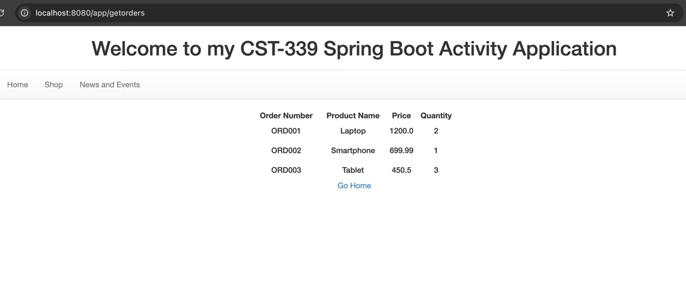
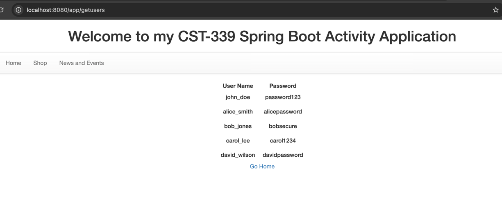
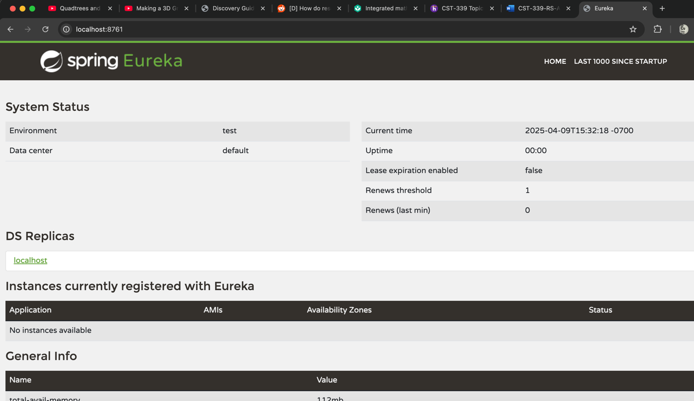
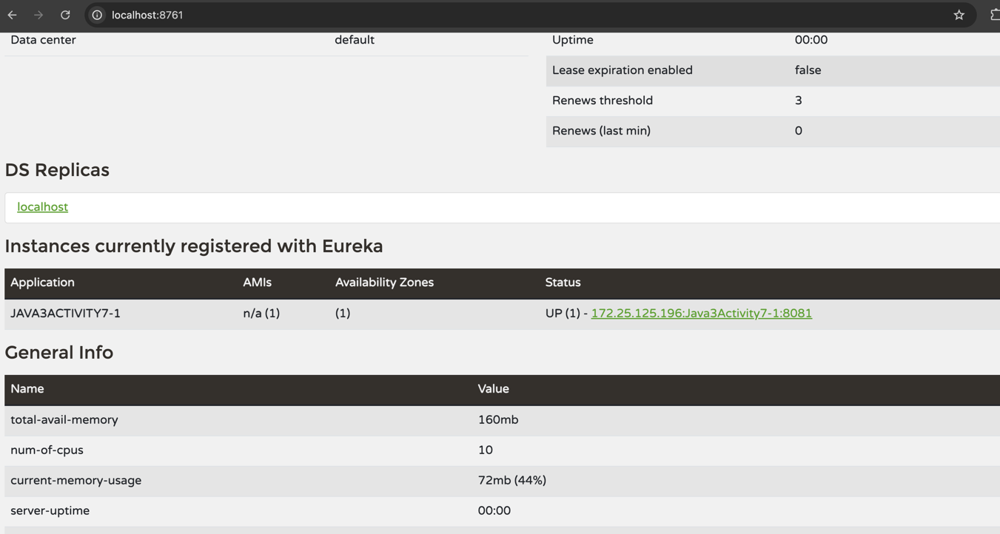
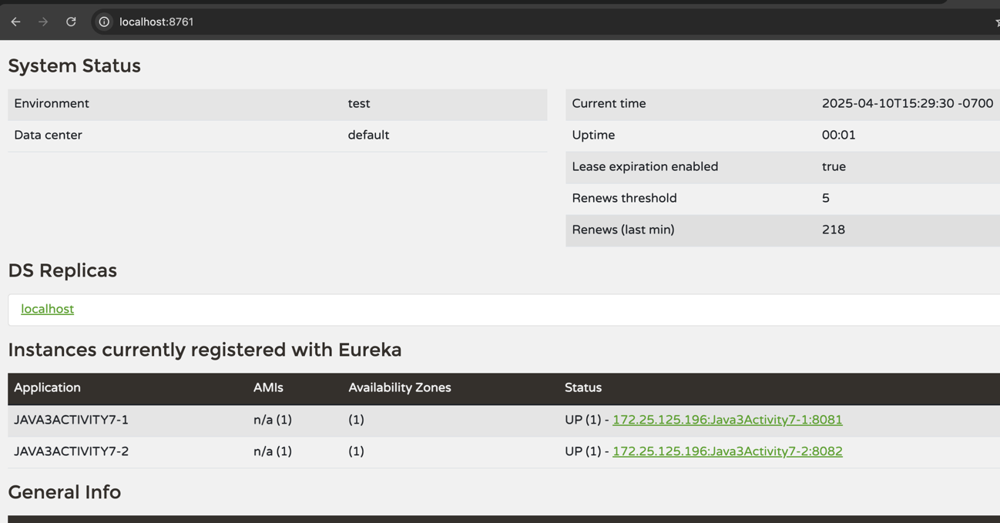

# CST339 - Activity 7
- Date: 2025 April 9 
- Author: Tyler Friesen

# Part 1 

--- 

### this is the orders page being loaded in from the orders microservice. The TestController is what's serving the HTML pages

---

### This is the users page being loaded in from the users microservice. The TestController is what's serving the HTML

---

# Part 2

### Eureka dashboard

---

### Registered service with Eureka

---

### Registered User and Order microservice with Eureka

### user page loaded from users microservice

---

### order page loaded from order microservice

---

## Research Questions

1. Microservices are a software architecture style that breaks down a large application into smaller, independent services. Each microservice is designed to handle a specific business function and can be developed, deployed, and scaled independently. These services communicate with each other through well-defined APIs, often using lightweight protocols like HTTP or messaging queues.

In contrast, a monolithic architecture is a single unified application where all components and functionalities are interconnected. This structure makes it difficult to isolate and scale individual parts of the application. Any small change typically requires rebuilding and redeploying the entire system, which can slow down development and introduce more risks.

The microservices approach offers greater flexibility and scalability. Developers can use different technologies for different services, scale only the parts of the application that need it, and allow multiple teams to work in parallel. Monolithic systems, while simpler to develop initially, often struggle with scalability and maintenance as the application grows.

2. One major challenge is data management. In monolithic systems, there is usually a single, centralized database. When moving to microservices, the data must be distributed across services, which introduces complexities in maintaining data consistency and integrity across different databases.

Another challenge is managing communication between services. Microservices must communicate over a network, which adds latency and increases the chances of failure. Designing reliable and secure inter-service communication, such as implementing retries and fallbacks, is essential but challenging.

A third challenge is the increased DevOps complexity. Each microservice requires its own deployment, monitoring, and scaling strategy. This means more infrastructure and automation tools are needed to manage the environment effectively.

Refactoring existing code is also difficult. Breaking down a large monolithic application requires identifying logical boundaries and carefully untangling tightly coupled code. This process can be time-consuming and may introduce new bugs if not done correctly.

Lastly, security becomes more complex. Each microservice can be an attack surface, so proper authentication, authorization, and encryption must be implemented for every service. Managing secure communication and access control across many small services increases the security workload.

## Christian Worldview Component

1. When creating high-performance, database-driven applications, developers can unintentionally compromise user privacy or consumer security. This can happen when applications collect personal data without clear or informed consent, store sensitive information (such as passwords or financial details) without proper encryption, or share data with third parties without user permission.

For example, consider a case where a developer stores passwords in plaintext during the testing phase and forgets to encrypt them before launching the application. If the system is breached, all user accounts are at risk, and the company may face serious legal and ethical consequences.

From a Christian worldview, this issue should be approached with a mindset of accountability and care for others. The Bible teaches us in Luke 6:31, “Do to others as you would have them do to you.” This means that developers should handle user data with the same level of caution and respect as they would expect for their own.

When discussing this with management—especially when they are concerned about deadlines—it is important to communicate the issue honestly and tactfully. A developer might say, “While I understand the pressure to meet our launch date, I’ve discovered a security risk that could endanger user data. As responsible stewards of this information, we must ensure our application meets ethical and legal standards. Addressing this now may prevent more serious delays or damage later.”

This approach not only aligns with Christian values of truth and integrity, but also appeals to the company’s long-term success and reputation. Supporting evidence could include recent high-profile data breaches, legal regulations like the GDPR, and ethical principles found in both professional conduct codes and Scripture.

